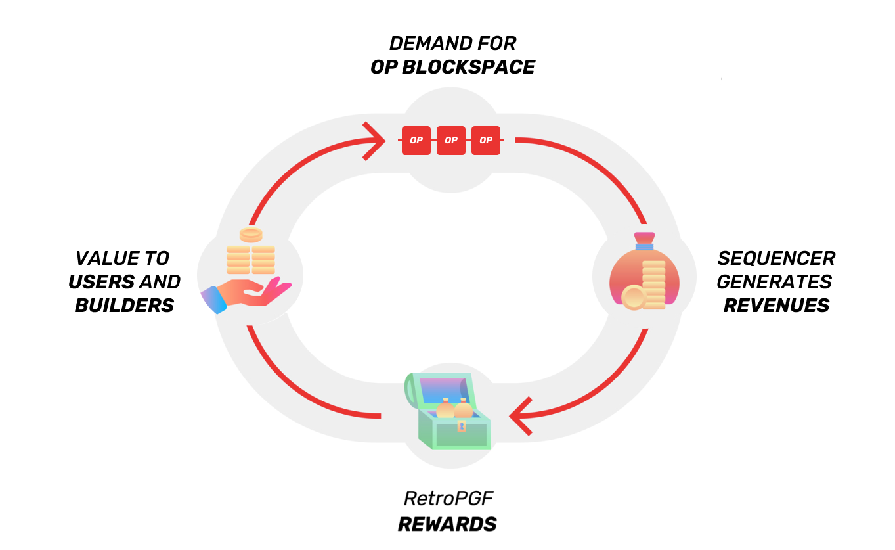

The Citizens' House is a large-scale experiment in [non-plutocratic governance](https://vitalik.ca/general/2021/08/16/voting3.html) and retroactive funding of public goods. 
The Citizens’ House will work alongside the Token House to govern the Optimism Collective. 

**In its first stage, the Citizens’ House is solely responsible for voting on retroactive public goods funding (RetroPGF)**. 
The initial set of Citizens in this stage is determined by (a) criteria set by the Optimism Foundation and (b) a special election from the Token House. 
During this bootstrapping phase, the Optimism Foundation will determine the scope and amount of each funding round, as well as administer the voting process. 
Holding a voting badge in this initial set of Citizens **does not guarantee permanent citizenship** or voting rights in all future rounds of RetroPGF.

In future stages, the Citizens’ House role will expand. 
For example, in addition to voting on RetroPGF funding, the Citizens’ House will work alongside the Token House to govern allocation of protocol profit, collaborate on criteria for participation in the Citizens’ House, and engage in a system of checks and balances to enforce the Collective’s Codes of Conduct.

Funding for RetroPGF may come from:

- **[20% of the initial OP supply](./allocations.md#retroactive-public-goods-funding)**
- Redeployment of some profit generated by the Optimism protocol.

Many values-aligned projects on Optimism have also chosen to contribute a portion of their revenue to retroPGF. 
If your project wants to contribute funds, you can send ETH, ERC-20 tokens, or NFTs to the ENS address **retroPGF.eth**. 
It is supported on **[Optimism](https://explorer.optimism.io/address/0x15dda60616ffca20371ed1659dbb78e888f65556)** as well as **[Ethereum mainnet](https://etherscan.io/address/0x15dda60616ffca20371ed1659dbb78e888f65556)**. 
Everything donated retroPGF.eth will be allocated to a RetroPGF round.

**What is described here is an initial experiment for RetroPGF 2**. The specifics of this system will evolve as the Collective grows.

## How RetroPGF Works

RetroPGF stands for Retroactive Public Goods Funding. 
This is a series of experiments where members of the Citizens’ House allocate protocol profits or portions of the token treasury to projects they deem have provided substantial public good along certain criteria.

RetroPGF is based on the idea that it’s easier to determine what *was* useful than to issue proactive grants for what *might* be useful. 

In each round of RetroPGF, Citizens vote on how to allocate protocol profits or portions of the token treasury to projects that have provided substantial public good. 
These rewards create strong incentives for people to build public goods that benefit the Optimism Collective. 
The aggregate effect is an ecosystem that is easier to build on, learn about, and connect to, in turn driving application usage and generating more demand for blockspace.
By funding public goods sustainably, the Collective can create a rich ecosystem and a better economy.

RetroPGF also provides possible exit liquidity for public goods projects, which opens up a market for early investment in those projects. 
This means builders can:

- Be compensated for their positive contributions without generating direct revenue.
- Raise capital to bootstrap based on the early potential and promise of their project.

RetroPGF is core to Optimism’s value of `impact = profit`:  the idea that that positive impact to the collective should be rewarded with profit to the individual.

In 2021, Optimism ran its [first round of RetroPGF](https://medium.com/ethereum-optimism/retroactive-public-goods-funding-33c9b7d00f0c).
Community members voted to distribute $1 million across 58 open source software projects. 

RetroPGF 2 takes place in Jan 2023. Read more [here](./rpgf-2.md). 

## A Commitment to Experimentation

RetroPGF is a longterm bet to build the future Optimists want to see. 
The Collective will conduct regular rounds of RetroPGF, each different from the last. 
This is an emergent process that will take community participation to grow and prune. 

RetroPGF has three core components, each with substantial surface area for experimentation. 

1. **Impact scoping**: what should the Collective fund? 
   How is it defined and decided on? 
1. **Impact scoring:** how does the Citizens’ House evaluate impact? 
   What units, process, or tools do we use? 
1. **Impact settlement:** how does voting work? 

For the first several rounds of RetroPGF, the Optimism Foundation will decide on scope and voting mechanics with input from the community. 
Eventually the set of variables around what to fund, how much to fund, and how to vote will be up to the Citizens’ House, with checks and balances from the Token House. 

Over time, the Collective aims to expand the scope of RetroPGF to support the production of public goods beyond the immediate Optimism ecosystem. 
To get there, we must refine the tools and processes used for RetroPGF based on regular experimentation.
