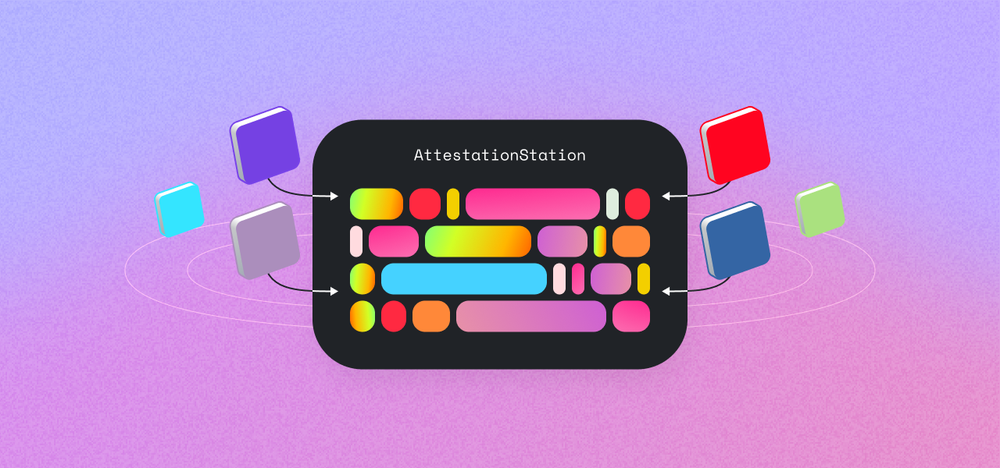

## About attestations

Attestations are one of the building blocks of decentralized identity.

Our journey towards decentralized identity begins with the AttestationStation, an attestation smart contract using the [Ethereum Attestation Service standard](https://optimism-goerli.easscan.org/) for creating, verifying, and revoking on/off-chain attestations. Attestations in the AttestationStation serve as the data layer towards the goal of enabling a decentralized identity and reputation system on any OP Chain in the Superchain. You can think of the AttestationStation as a multiplayer database. 

An attestation is a signed statement about a person, entity, or thing, made by an individual, company, or organization.

The reliability of an attestation is dependent on the credibility of the person or entity making the statement. When the attestation pertains to significant matters, such as a credit score, it is only considered valuable if it comes from a trusted source, such as a credit score provider.

It is essential to note that attestations should not be viewed as a replacement for verifiable credentials or decentralized identifiers. Rather developers can use AttestationStation to create [decentralized identifiers](https://www.w3.org/TR/did-core/), credentials, claims, and more.

AttestationStation is a shared public database for streamlining the attestation process and establishing a robust trust network.

## Benefits of using the AttestationStation

The AttestationStation makes it easy to sign any piece of data. In addition, here are a few key benefits:

- **Permissionless**: The AttestationStation is a public contract, which means that it is not owned or controlled by any one person or organization. 
  Anyone can use the contract to verify and attest anything.
- **Tooling:** Indexing, various access-management integrations, and more are already available (and growing) for the AttestationStation.
- **Value accrual:** As the Superchain grows, so does the amount of funding for Retroactive Public Goods Funding (RetroPGF) and therefore the value of having information about users who can become Citizen House members (those responsible for allocating that funding) or run projects that get RetroPGF. 
  We are especially interested in attestations that identify users who contribute to positive sum games and those with additional expertise.

## Ideas

Are you inspired and don’t know what to build? 
We have a [project idea list](https://optimism.io/ideas). 
Do you have a good idea, but you know you’re not the right person to build it? Please open a PR on that list and suggest it.

## Privacy

::: danger <nbsp />

Attestations create log entries that become part of the permanent record of the blockchain. 
Here are some best practices to avoid violating users’ privacy:

- Obtain explicit consent from users for personal information. 
  Clearly inform them what data is being collected, why it is being collected, and how it will be used.
- Sensitive data should not be stored onchain, in any way. 
  If you need a smart contract to verify it in the future, you can use the hash of the sensitive data rather than the data itself.
- Even when storing sensitive data offchain, you need to ensure it is stored securely using encryption, proper authentication and authorization, etc.

:::
