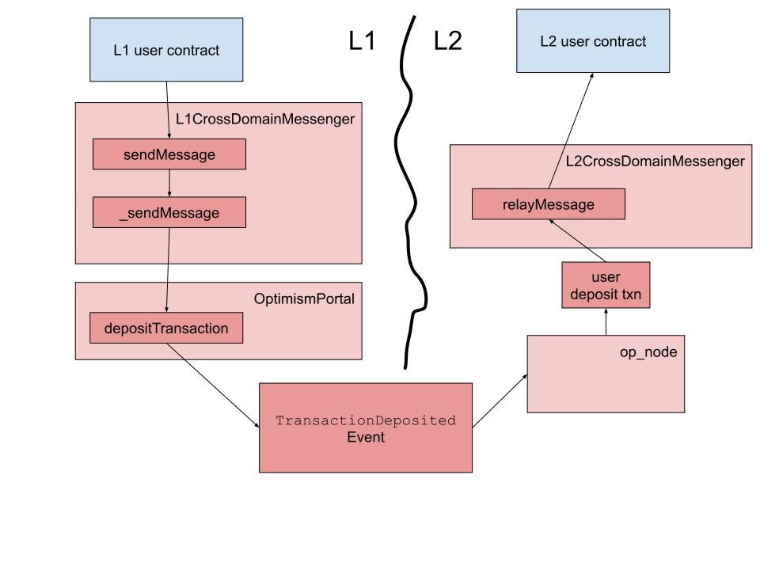

## Introduction

In Optimism terminology *deposit* refers to any transaction that goes from L1 to L2.
A deposit transaction may or may not have assets (ETH, tokens, etc.) attached to it.

The process is somewhat similar to [the way most networking stacks work](https://en.wikipedia.org/wiki/Encapsulation_(networking)).
Information is encapsulated in lower layer packets on the sending side, and then retrieved in those layers on the receiving side before being available 




## L1 Processing

1. An L1 entity, either a smart contract or an externally owned account (EOA), sends a deposit transaction to [`L1CrossDomainMessenger`](https://github.com/ethereum-optimism/optimism/blob/develop/packages/contracts-bedrock/contracts/L1/L1CrossDomainMessenger.sol), using [`sendMessage`](https://github.com/ethereum-optimism/optimism/blob/develop/packages/contracts-bedrock/contracts/universal/CrossDomainMessenger.sol#L259). 
  This function accepts three parameters:

   - `_target`, target address on L2.
   - `_message`, the L2 transaction's calldata, [formatted as per the ABI](https://docs.soliditylang.org/en/v0.8.19/abi-spec.html).
   - `_minGasLimit`, the gas limit required for the transaction on L2. 
     Note that the actual amount will be higher, because the portal contract on L2 needs to do some processing before submitting the call to `_target`.

   You can see code that implements this call [in the tutorial](https://github.com/ethereum-optimism/optimism-tutorial/blob/main/cross-dom-comm/hardhat/contracts/FromL1_ControlL2Greeter.sol#L16).

1. The L1 cross domain messenger calls [its own `_send` function](https://github.com/ethereum-optimism/optimism/blob/develop/packages/contracts-bedrock/contracts/L1/L1CrossDomainMessenger.sol#L45-L52).
   It uses these parameters:

   - `_to`, the destination address, is the messenger on the other side. 
     In the case of deposits, this is always [`0x4200000000000000000000000000000000000007`](https://goerli-optimism.etherscan.io/address/0x4200000000000000000000000000000000000007).
   - `_gasLimit`, the gas limit. 
     This value is calculated using [the `baseGas` function](https://github.com/ethereum-optimism/optimism/blob/develop/packages/contracts-bedrock/contracts/universal/CrossDomainMessenger.sol).
   - `_value`, the ETH that is sent with the message.
     This amount is taken from the transaction value.
   - `_data`, the calldata for the call on L2 that is needed to relay the message.
     This is an [ABI encoded](https://docs.soliditylang.org/en/v0.8.19/abi-spec.html) call to [`relayMessage`](https://github.com/ethereum-optimism/optimism/blob/develop/packages/contracts-bedrock/contracts/universal/CrossDomainMessenger.sol#L303).

1. [`_sendMessage`](https://github.com/ethereum-optimism/optimism/blob/develop/packages/contracts-bedrock/contracts/L1/L1CrossDomainMessenger.sol#L45-L52) calls the portal's [`depositTransaction` function](https://github.com/ethereum-optimism/optimism/blob/develop/packages/contracts-bedrock/contracts/L1/OptimismPortal.sol#L434).

1. [The `depositTransaction` function](https://github.com/ethereum-optimism/optimism/blob/develop/packages/contracts-bedrock/contracts/L1/OptimismPortal.sol#L434) runs a few sanity checks, and then emits a [`TransactionDeposited`](https://github.com/ethereum-optimism/optimism/blob/develop/packages/contracts-bedrock/contracts/L1/OptimismPortal.sol#L85-L99) event. 


## L2 Processing

1. The `op-node` component [looks for `TransactionDeposited` events on L1](https://github.com/ethereum-optimism/optimism/blob/develop/op-node/rollup/derive/deposits.go#L14-L33).
   If it sees any such events, it [parses](https://github.com/ethereum-optimism/optimism/blob/develop/op-node/rollup/derive/deposit_log.go) them.

1. Next, `op-node` [converts](https://github.com/ethereum-optimism/optimism/blob/develop/op-node/rollup/derive/deposits.go#L35-L51) those `TransactionDeposited` events into [deposit transactions](https://github.com/ethereum-optimism/optimism/blob/develop/specs/deposits.md#user-deposited-transactions).

1. In most cases user deposit transactions call the [`relayMessage`](https://github.com/ethereum-optimism/optimism/blob/develop/packages/contracts-bedrock/contracts/universal/CrossDomainMessenger.sol#L303-L413) function of [`L2CrossDomainMessenger`](https://github.com/ethereum-optimism/optimism/blob/develop/packages/contracts-bedrock/contracts/L2/L2CrossDomainMessenger.sol).

1. `relayMessage` runs a few sanity checks and then, if everything is good, [calls the real target contract with the relayed calldata](https://github.com/ethereum-optimism/optimism/blob/develop/packages/contracts-bedrock/contracts/universal/CrossDomainMessenger.sol#L394).

## Denial of service (DoS) prevention

As with all other L1 transactions, the L1 costs of a deposit are borne by the transaction's originator.
However, the L2 processing of the transaction is performed by the Optimism nodes.
If there were no cost attached, an attacker could be able to submit a transaction that had high costs of run on L2, and that way perform a denial of service attack.

To avoid this DoS vector, [`depositTransaction`](https://github.com/ethereum-optimism/optimism/blob/develop/packages/contracts-bedrock/contracts/L1/OptimismPortal.sol#L434), and the functions that call it, require a gas limit parameter.
[This gas limit is encoded into the `TransactionDeposited`(https://github.com/ethereum-optimism/optimism/blob/develop/packages/contracts-bedrock/contracts/L1/OptimismPortal.sol#L472-L482) event], and used as the gas limit for the user deposit transaction on L2.

This L2 gas is paid for by burning L1 gas [here](https://github.com/ethereum-optimism/optimism/blob/develop/packages/contracts-bedrock/contracts/L1/ResourceMetering.sol#L162). 

## Replaying messages

Deposits are transactions, and as such can fail due to several reasons:

- Not enough gas provided.
- The state on L2 does not allow the transaction to be successful.

It is possible to replay a failed deposit, possibly with more gas, 

<!-- 

### Replays in action

To see how replays work, you can use [this contract on Optimism Goerli](https://goerli-optimism.etherscan.io/address/0x26A145eccDf258688C763726a8Ab2aced898ADe1#code). 

1. Call `stopChanges`. 
   You can do that either [from Etherscan](https://goerli-optimism.etherscan.io/address/0x26A145eccDf258688C763726a8Ab2aced898ADe1#writeContract#F3), or using this Foundry command (after you set `$PRIV_KEY` to your private key, and `$ETH_RPC_URL` to a URL to Optimism Goerli):

   ```sh
   GREETER=0x26A145eccDf258688C763726a8Ab2aced898ADe1
   cast send --private-key $PRIV_KEY $GREETER "stopChanges()"
   ```

1. Verify that `getStatus()` returns `False`, meaning changes are not allowed, and see the value of `greet()`.
   Again, you can do this from [Etherscan](https://goerli-optimism.etherscan.io/address/0x26A145eccDf258688C763726a8Ab2aced898ADe1#readContract), or use Foundry:

   ```sh
   cast call $GREETER "greet()" | cast --to-ascii ; cast call $GREETER "getStatus()"
   ```

1. Get the calldata.
   You can use [an online calculator](https://abi.hashex.org/) with these parameters:

   | Field         | Type | Value
   | - | - | - |
   | Function | your function | `setGreeting(string)`
   | Argument | String | `testing`

   Alternatively, you can use this Foundry command:

   ```sh
   cast calldata "setGreeting(string)" "testing"
   ```

   Or just use this value: 
   
   ```
   0xa41368620000000000000000000000000000000000000000000000000000000000000020000000000000000000000000000000000000000000000000000000000000000774657374696e6700000000000000000000000000000000000000000000000000
   ```

1. Send a greeting change as a deposit.

   - To do this using [Etherscan](https://goerli.etherscan.io/address/0x5086d1eEF304eb5284A0f6720f79403b4e9bE294#writeProxyContract#F5), use these parameters:

     | Parameter | Value |
     | - | - 
     | payableAmount | 0 
     | _target       | 0x26A145eccDf258688C763726a8Ab2aced898ADe1
     | _message      | The calldata you created in the previous step
     | _minGasLimit  | 50000

   - To send the greeting change as a deposit using Foundry, use these commands:

     ```sh
     L1_RPC=<URL to Goerli>
     L1_CROSS_DOM_COMM=0x5086d1eef304eb5284a0f6720f79403b4e9be294
     FUNC="sendMessage(address,bytes,uint32)"
     CALLDATA=`cast calldata "setGreeting(string)" "testing"`
     cast send --rpc-url $L1_RPC --private-key $PRIV_KEY $L1_CROSS_DOM_COMM $FUNC $GREETER $CALLDATA 50000
     ```

1. The next step is to find the hash of the failed message.
   The easiest way to do this is to look in [the internal transactions of the destination contract](https://goerli-optimism.etherscan.io/address/0x26A145eccDf258688C763726a8Ab2aced898ADe1#internaltx), select the latest one, and then look at the transaction's events.
   There should be a `FailedRelayedMessage` event, similar to [this one](https://goerli-optimism.etherscan.io/tx/0xbfc03667d9bd8673bc6058f7db7c319f8f6962053ad5328664544b1c6f0235e3#eventlog).
   The parameter to that log entry is the hash we need to replay.

   


1. 

-->